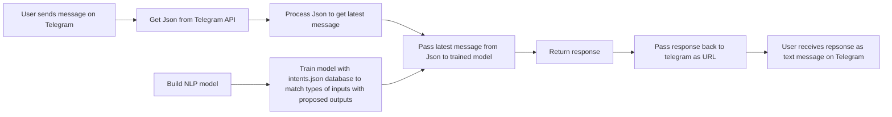

# Personal-Telegram-Bot
This is a Transactional Chatbot built with Python and integrates with Telegram.

This was built using 2 tutorials:
1. https://www.codementor.io/@garethdwyer/building-a-telegram-bot-using-python-part-1-goi5fncay
2. https://github.com/python-engineer/pytorch-chatbot
So thank you very much to @garethdwyer and Python Engineer! Everything that works here is credit to them, anything that doesn't is me

This bot allows you to create your own transactional chatbot on Telegram using Python.

1.  How does the bot work?

2. What did I do to the code from the 2 tutorials?
Honestly not sure. This is my first time coding so I bulldozed through problems in the most inelegant way possible. Code from both tutorials have been frankensteined and arguments have been changed to make it work. I considered importing scripts into one another but I didn't understand the argument logic well enough to make it work so I formed my own.

To modify this into your own, here are the steps:
1. Setup environment, train model and customise intents.json database
- Refer here: https://github.com/python-engineer/pytorch-chatbot
- Setup environment by  importing appropriate modules
- Customise intents.json
- Run train.py to create data.pth
- No need to run chat.py unlike the original tutorial. Data.pth is your trained model data and will be imported into chatbot_proper.py

2. Get your telegram bot api token using Botfather
- https://www.siteguarding.com/en/how-to-get-telegram-bot-api-token

3. Fill in Telegram token and bot name in chatbot_proper.py

4. Bot is setup and should work. Start it locally by running chatbot_proper.py on Terminal. Then, send your first input message on Telegram and you should get a response according to your intens.json.
